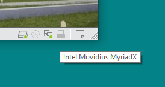
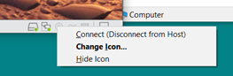
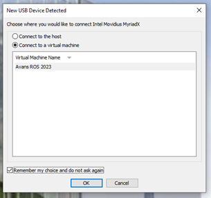
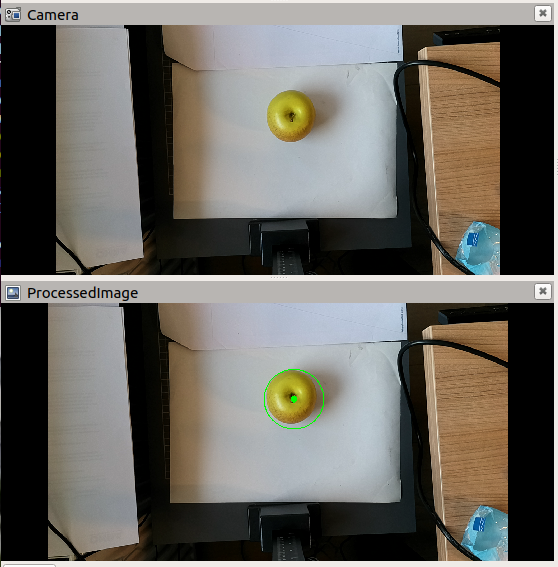
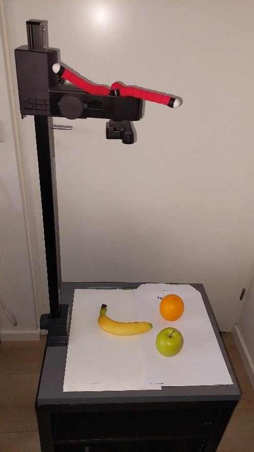
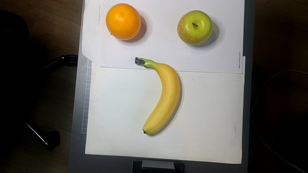
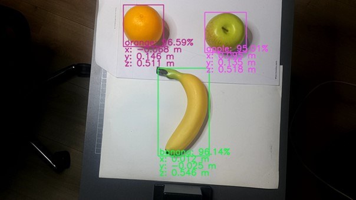

# DepthAI Demostratie (ROS-Melodic versie)


In dit document “DepthAI-Demostrator” worden voorbeeldprogramma’s gepresenteerd welke met behulp van een Luxonis OAD-D camera objecten kan detecteren:
* Lokalisatie van cirkels in de omgevingsruimte (XYZ)
* Detectie en lokalisatie van vooraf getrainde objecten in de omgevingsruimte (XYZ)

n.b. de waardes van de locatie (XYZ) betreft het punt van het object dat zich het dichts bij de camera bevindt.

## Benodigdheden
* [Luxonis OAK-D camera](https://docs.luxonis.com/projects/hardware/en/latest/pages/BW1098OAK.html)


## Voorbereiding
Voorafgaand aan deze setup dient het volgende geïnstalleerd te zijn:
* ROS Melodic + ROS base packages (deze zijn al geïnstalleerd op de Avans ROS image)
* Er wordt verondersteld dat er een al een workspace <my_robot>_ws is gecreëerd.

Let op: Volg nauwkeurig de instructies in de volgorde hier gegeven. Een verkeerde volgorde of het overslaan van handeling kan ervoor zorgen dat de demonstratie programma’s niet werkt!

## Installeren en bouwen van benodigde packages
```bash
sudo apt update
sudo apt upgrade
sudo apt-get install ros-melodic-ros-numpy
sudo wget -qO- https://raw.githubusercontent.com/luxonis/depthai-ros/main/install_dependencies.sh | sudo bash
cd $HOME/<my_robot>_ws/src

git clone https://github.com/AvansMechatronica/depth-ai-avans.git

cd ..
rosdep install --from-paths src --ignore-src -r -y
catkin b -j1
source devel/setup.bash
cd src
git clone https://github.com/AvansMechatronica/my_depthai.git
catkin b -j1
```
*Let op: bij de catkin opties je dient hieraan het argument -j1 toe te voegen om foutmeldingen te voorkomen*
 

## ROS-Environment toepassen
```bash
source  $HOME/<my_robot>_ws/devel/setup.bash
```

## Camera verbinden met computer

Verbinden Luxonis OAK-D camera met de development computer(virtuele machine)
* Verbindt de Luxonis OAK-D camera met een USB-poort van de development computer
* Beweeg de muispointer over de icoontjes linksonder van de virtuele machine totdat je de Intel Movidius MyriadX connectie ziet en click op het betreffende icoontje

 

* Selecteer vervolgens Connect (Disconnect from Host)

 



*Zorg er voor de “Remember my choice and do not ask again” aangevinkt is.*

Bij het starten van nodes voor de Luxoinis OAK-D camera kan nogmaals bovenstaande procedure herhaald moeten worden (handel dan snel !!!).

Hierna is de Luxoinis OAK-D camera verbonden met de virtuele machine, je kunt dezelfde handelingen ook doen voor andere type (industriële) USB-camera’s

## Voorbeelden
Er worden hierna 2 voorbeelden(applicaties) gepresenteerd voor het gebruik van de Luxoinis OAK-D camera:

•	Image processing applicatie: Cirkel detectie

•	Machine learning applicate: Object classification & localization 


### Image processing applicatie: Cirkel detectie
```bash
roslaunch my_depthai circle_detector.launch
```
Door dit launch wordt de usb-camera node en de image-processing node gestart. Ook wordt RVIZ opgestart. Je zult nu twee beelden zien met het originele beeld en de het verwerkte beeld.


 
#### Positie van de cirkels
De positie van de cirkels worden gepubliceerd in een ROS-topic “/image_processor/circle_center”. Je kunt deze opvragen met:
```bash
rostopic echo /image_processor/circle_center
```
#### Image-processing source-code

Het python programma dat de cirkels detecteert(omcirkels) kun je vinden:
* **$HOME/<my_robot>_ws/src/my_depthai/scripts/circle_detector.py**

Werking:
Doormiddel van een “HoughCircles” openCV functie worden cirkels in een image topic gedetecteerd en in een nieuw image topic gepubliceerd.

* *Subscriber:  /stereo_inertial_nn_publisher/color/image (remap naar image_in)*

* *Publisher: /stereo_inertial_nn_publisher/color/circles (remap van image_out)*

Je kunt het python-script gebruiken als template voor je eigen image-processor. 

### Machine learning applicate: Object classification & localization 
```bash
roslaunch my_depthai nn_detector.launch
````
Door dit launch wordt de usb-camera node en de nn_detector (neural network) node gestart. Ook wordt RVIZ opgestart. Je zult nu twee beelden zien met het originele beeld en de het verwerkte beeld.




#### Positie van de objecten
De positie van de objecte  worden gepubliceerd in een ROS-topic *“/stereo_inertial_nn_publisher/color/detections”*. Je kunt deze opvragen met:
```bash
rostopic echo /stereo_inertial_nn_publisher/color/detections
```

#### nn Detector source-code

Het python programma dat de objecten van een boudingbox, titel en locatie voorziet kun je vinden:

* **$HOME/<my_robot>_ws/src/my_depthai/scripts/nn_detector_display.py**

Werking:
Doormiddel van een “rectangle” en putText openCV functies worden boudingboxes, labels en coördinaten in een SpatialDetectionArray topic gedetecteerd en aan een image topic toegevoegd. Hierdoor ontstaat een nieuw image dat als topic wordt gepubliceerd.

* *Subscriber:  /stereo_inertial_nn_publisher/color/image (remap naar image_in)*
* *Subscriber: /stereo_inertial_nn_publisher/color/detections (remap naar detections)*
Publisher: /stereo_inertial_nn_publisher/color/detections_image (remap van image_out)

Je kunt het python-script gebruiken als template voor je eigen object detector. 

## Eigen Neuraal netwerk gebruiken
Een eigen getraind netwerk of netwerk van een AI-zoo kun je gebruiken door de een verwijzing te maken naar je eigen NN-Netwerk bestanden in het volgende bestand:

* **$HOME/<my_robot>_ws/src/my_depthai/launch/nn_detector.launch**

*Zie regels 59 t/m 65*
```xml
<!-- Network trainded by pyTorch -->
<arg name="nnName"                 default="SimpleFruitsv1iyolov5pytorch_openvino_2021.4_6shave.blob" if="$(eval arg('yoloPyTorch') == true)"      />
<arg name="nnConfig" default="SimpleFruitsv1iyolov5pytorch.json" if="$(eval arg('yoloPyTorch') == true)"/>

<!-- network trainded by Roboflow -->
<arg name="nnName" default="simplefruits_V1.blob"  unless="$(eval arg('yoloPyTorch') == true)"/>
<arg name="nnConfig" default="simplefruits_V1.txt"  unless="$(eval arg('yoloPyTorch') == true)"/>
```
De NN-netwerk bestanden dien je in de volgende map te plaatsen:

* **$HOME/<my_robot>_ws/src/my_depthai/resources**

Een NN-Netwerk (type pyTorch) kun je trainen met het volgende google-colab script:

* [Google Colab tranings script](https://colab.research.google.com/drive/1aT4W-coZ4yOy8CvZbr0pd4W_4gdZCWzC?usp=sharing)


## Luxonis OAK-camera in URDF & TF
Je kunt de camera publiceren als grafisch object in RVIZ en binnen TF in je eigen robot omgeving.
Doe dit door de juiste locatie van de camera in het volgend bestand aan te passen:

* **$HOME/<my_robot>_ws/src/my_depthai/launch/nn_detector.launch**

<p style="text-align:center;">of</p>

* **$HOME/<my_robot>_ws/src/my_depthai/launch/circle_detector.launch**

*Zie regels 15 t/m 20*
```xml
<arg name="cam_pos_x" default="0.25" /> <!-- Position respect to base frame (i.e. "base_link) -->
<arg name="cam_pos_y" default="0.0" /> <!-- Position respect to base frame (i.e. "base_link) -->
<arg name="cam_pos_z" default="0.5" /> <!-- Position respect to base frame (i.e. "base_link) -->
<arg name="cam_roll" default="0.0" /> <!-- Orientation respect to base frame (i.e. "base_link) -->
<arg name="cam_pitch" default="0.0" /> <!-- Orientation respect to base frame (i.e. "base_link) -->
<arg name="cam_yaw" default="0.0" /> <!-- Orientation respect to base frame (i.e. "base_link) -->
```

## Nader Informatie
Op de volgende websites kun je meer informatie vinden over Luxonis OAK-DepthAI camera:

* [OAK-D Camera](https://docs.luxonis.com/hardware/products/OAK-D)


